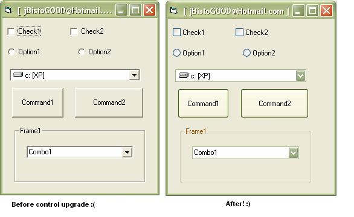

## WINDOWS XP THEME STYLE BUTTONS ETC\!\! UPGRADE CONTROLS\!

### Description

THIS CODE WILL ONLY UPGRADE CONTROLS IN WINDOWS XP, tho it wont cause any errors etc in other OSs..... ever wanted ur controls to look like the ones in windows XP, but didnt know how? simple... this program is completely self contained... NO EXTRA DLLs, OCXs ETC ARE NEEDED! PROGRAM CREATES THE THEME RESOURCE (manifest) IF IT DOESNT EXIST! look at the screenshot! by: tHe_cLeanER, enjoy!
 
### More Info
 

             |
---                |---
**Submitted On**   |2001-10-28 22:57:44
**By**             |[Jon Barker](https://github.com/Planet-Source-Code/PSCIndex/blob/master/ByAuthor/jon-barker.md)
**Level**          |Intermediate
**User Rating**    |5.0 (15 globes from 3 users)
**Compatibility**  |VB 5\.0, VB 6\.0
**Category**       |[Windows System Services](https://github.com/Planet-Source-Code/PSCIndex/blob/master/ByCategory/windows-system-services__1-35.md)
**World**          |[Visual Basic](https://github.com/Planet-Source-Code/PSCIndex/blob/master/ByWorld/visual-basic.md)
**Archive File**   |[WINDOWS XP3164610282001\.zip](https://github.com/Planet-Source-Code/jon-barker-windows-xp-theme-style-buttons-etc-upgrade-controls__1-28484/archive/master.zip)

